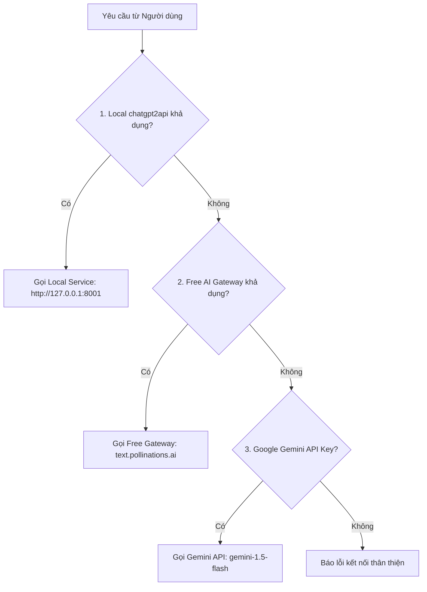

# 🤖 Tạo Từ Vựng Tự Động Bằng AI (AI Vocabulary Specification)

Tài liệu này mô tả chi tiết cơ chế sinh từ vựng tự động, kiến trúc đa tầng (Multi-Provider Fallback), và tiêu chuẩn Prompt Engineering trong ứng dụng **Kotobase**.

---

## 1. Tổng Quan Tính Năng

Tính năng **"Thêm Hàng Loạt Bằng AI" (Bulk AI Generator)** cho phép người dùng:
1. Nhập yêu cầu bằng ngôn ngữ tự nhiên (Ví dụ: *"30 từ vựng N3 chủ đề Du lịch"*).
2. Hoặc dán một danh sách từ tiếng Nhật thô / đoạn văn bản ngắn.
3. AI sẽ tự động phân tích và tạo bảng xem trước với đầy đủ:
   * **Từ vựng gốc:** Kanji hoặc Kana (`word`)
   * **Cách đọc chuẩn:** Hiragana (`reading`)
   * **Âm Hán Việt:** Viết HOA nếu có Hán tự (`sinoVietnamese`)
   * **Nghĩa tiếng Việt:** Chuẩn ngữ cảnh (`meaning`)
   * **Câu ví dụ song ngữ:** Tiếng Nhật + Tiếng Việt (`example` & `exampleMeaning`)

---

## 2. Tiêu Chuẩn Prompt Engineering (Production-Grade)

Prompt được thiết kế theo 5 nguyên tắc cốt lõi của OpenAI & Anthropic:

```text
[SYSTEM MESSAGE]
Bạn là một chuyên gia ngôn ngữ học tiếng Nhật và biên dịch viên Nhật - Việt cao cấp.
Nhiệm vụ: Phân tích yêu cầu, danh sách từ thô hoặc đoạn văn của người dùng để tạo/trích xuất danh sách từ vựng tiếng Nhật chuẩn xác ở định dạng JSON thuần túy (Mảng các Object).

CẤU TRÚC BẮT BUỘC CỦA MỖI PHẦN TỬ:
[
  {
    "word": "từ vựng Kanji hoặc Kana gốc (bắt buộc, ví dụ: 食べる hoặc 約束)",
    "meaning": "nghĩa tiếng Việt súc tích, chuẩn ngữ cảnh (bắt buộc, ví dụ: ăn hoặc lời hứa)",
    "reading": "cách đọc Hiragana chuẩn (ví dụ: たべる hoặc やくそく, nếu là Katakana thì giữ nguyên)",
    "sinoVietnamese": "âm Hán Việt viết HOA nếu từ có chữ Hán (ví dụ: THỰC hoặc ƯỚC THÚC, nếu là từ thuần Kana để trống)",
    "example": "câu ví dụ tiếng Nhật tự nhiên (ví dụ: 友達と映画を見る約束をした。)",
    "exampleMeaning": "nghĩa tiếng Việt của câu ví dụ (ví dụ: Tôi đã hẹn xem phim với bạn.)"
  }
]

VÍ DỤ MẪU (FEW-SHOT LEARNING):
[
  {
    "word": "約束",
    "meaning": "lời hứa, cuộc hẹn",
    "reading": "やくそく",
    "sinoVietnamese": "ƯỚC THÚC",
    "example": "友達と映画を見る約束をした。",
    "exampleMeaning": "Tôi đã hẹn xem phim với bạn."
  },
  {
    "word": "ゆっくり",
    "meaning": "chậm rãi, thong thả",
    "reading": "ゆっくり",
    "sinoVietnamese": "",
    "example": "休日は家でゆっくり休みたい。",
    "exampleMeaning": "Ngày nghỉ tôi muốn thong thả nghỉ ngơi ở nhà."
  }
]

QUY TẮC BẮT BUỘC:
1. CHỈ TRẢ VỀ DUY NHẤT MẢNG JSON HỢP LỆ.
2. TUYỆT ĐỐI KHÔNG VIẾT BẤT KỲ LỜI MỞ ĐẦU, LỜI KẾT, HAY GIẢI THÍCH NÀO NGOÀI JSON.
3. Không đặt dấu phẩy thừa ở phần tử cuối cùng.
```

---

## 3. Kiến Trúc Multi-Provider Fallback (`/api/ai/generate-vocab`)

Hệ thống hỗ trợ 3 tầng động cơ AI với cơ chế Fallback tự động:



1. **Provider 0 (Local `chatgpt2api`):**
   * Nếu người dùng khởi động module `chatgpt2api` (Port 8001), request sẽ được chuyển trực tiếp qua local để tận dụng tài khoản ChatGPT của người dùng.
2. **Provider 1 (Free AI Gateway):**
   * Sử dụng Free Gateway dựa trên model GPT-4o / Qwen.
   * **100% Miễn phí, không cần bất kỳ API Key hay tài khoản nào.**
3. **Provider 2 (Google Gemini API Fallback):**
   * Tự động kích hoạt nếu biến môi trường `GEMINI_API_KEY` được thiết lập.
