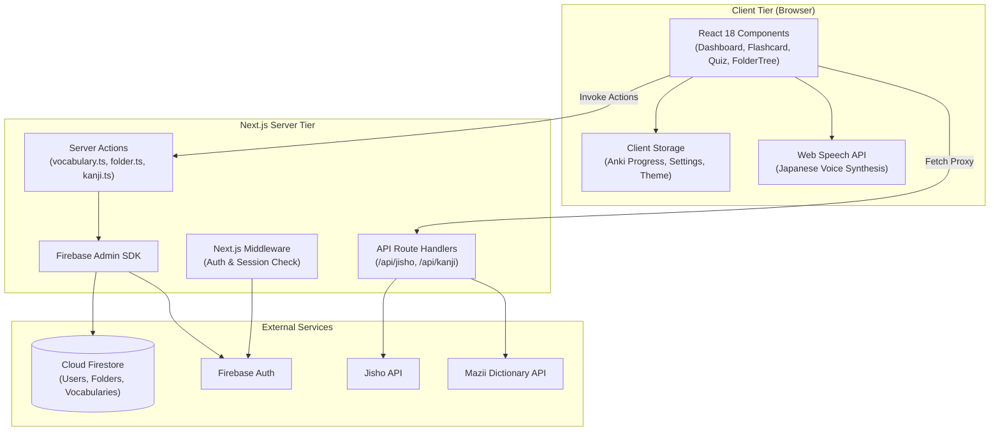

# Kiến Trúc Hệ Thống KotoBase (Architecture & System Design)

Tài liệu này mô tả chi tiết kiến trúc phần mềm, cấu trúc thư mục, luồng dữ liệu (Data Flow) và các logic miền nghiệp vụ (Domain Logic) cốt lõi của ứng dụng **KotoBase**.

---

## 1. Tổng Quan Kiến Trúc (Architecture Overview)

KotoBase được xây dựng theo mô hình **Next.js Fullstack Architecture (App Router)** kết hợp cơ sở dữ liệu NoSQL phân tán **Google Cloud Firestore**.



---

## 2. Sơ Đồ Cấu Trúc Thư Mục (Directory Structure)

```text
kotobase/
├── docs/                      # Tài liệu kỹ thuật và hướng dẫn dự án
│   ├── SETUP.md               # Hướng dẫn cài đặt và cấu hình local
│   └── ARCHITECTURE.md        # Tài liệu kiến trúc và giải pháp kỹ thuật
├── src/
│   ├── app/                   # Next.js 14 App Router (Routing, Layouts, Actions, APIs)
│   │   ├── actions/           # Next.js Server Actions (Thao tác trực tiếp với Database)
│   │   │   ├── auth.ts        # Xử lý đăng nhập, phiên session, cookies
│   │   │   ├── folder.ts      # CRUD cây thư mục, cập nhật quan hệ cha-con
│   │   │   ├── kanji.ts       # Xử lý dữ liệu Hán tự & bóc tách từ vựng
│   │   │   └── vocabulary.ts  # CRUD từ vựng, di chuyển thư mục, bulk import
│   │   ├── api/               # API Route Handlers (Proxy bên thứ 3)
│   │   │   ├── auth/          # Endpoint xác thực phiên
│   │   │   ├── jisho/         # Proxy tra cứu Jisho (tránh CORS)
│   │   │   ├── kanji/         # Proxy tra cứu Mazii Kanji
│   │   │   └── vocabulary/    # REST endpoints bổ trợ
│   │   ├── kanji/             # Trang tra cứu Sổ tay Hán tự riêng biệt
│   │   ├── login/             # Trang đăng nhập / xác thực
│   │   ├── globals.css        # Cấu hình CSS toàn cục & biến màu
│   │   ├── layout.tsx         # Root Layout (Theme Provider, Toaster)
│   │   └── page.tsx           # Trang chính (Entry Point Dashboard)
│   ├── components/            # Giao diện người dùng (React UI Components)
│   │   ├── AnkiSettingsModal.tsx    # Cấu hình tham số thuật toán Anki SRS
│   │   ├── BulkImport.tsx           # Form nhập nhanh từ vựng số lượng lớn
│   │   ├── ClickableKanjiString.tsx # Component nhận diện và click tra cứu từng chữ Hán
│   │   ├── Dashboard.tsx            # Component trung tâm điều phối các View
│   │   ├── FlashcardView.tsx        # Giao diện học thẻ lật & thuật toán Anki SRS
│   │   ├── FocusRecallView.tsx      # Chế độ luyện phản xạ ẩn nghĩa
│   │   ├── FolderTree.tsx           # Cây thư mục lồng nhau hỗ trợ Drag & Drop
│   │   ├── JishoSearchResults.tsx   # Hiển thị kết quả tìm kiếm từ điển Jisho
│   │   ├── KanjiDictionaryView.tsx  # Giao diện sổ tay Hán tự & tra cứu nét/âm
│   │   ├── QuickAddForm.tsx         # Modal thêm nhanh từ vựng & kiểm tra trùng
│   │   ├── TTSSettingsModal.tsx     # Cấu hình phát âm tiếng Nhật
│   │   └── TypingQuizView.tsx       # Trắc nghiệm gõ phím Romaji/Kana
│   ├── hooks/                 # Custom React Hooks
│   │   └── useDebounce.ts     # Hook debounce giảm tần suất truy vấn search
│   ├── lib/                   # Thư viện tiện ích và cấu hình hệ thống
│   │   ├── anki-utils.ts      # Logic thuật toán Spaced Repetition (SuperMemo SM-2)
│   │   ├── auth-utils.ts      # Utility xác thực token Firebase
│   │   ├── firebase-admin.ts  # Khởi tạo Firebase Admin SDK (Server-side)
│   │   ├── firebase.ts        # Khởi tạo Firebase Client SDK (Client-side)
│   │   ├── kanji-parser.ts    # Utility phân tích, trích xuất Kanji từ chuỗi
│   │   ├── session.ts         # Quản lý mã hóa session cookie
│   │   └── tts-utils.ts       # Utility quản lý Web Speech API / TTS
│   └── middleware.ts          # Middleware bảo vệ route và kiểm tra session cookie
├── public/                    # Tài nguyên tĩnh (Icons, Images)
├── package.json               # Khai báo dependencies và scripts
├── tailwind.config.js         # Cấu hình hệ thống Design Token Tailwind CSS
└── tsconfig.json              # Cấu hình TypeScript
```

---

## 3. Các Phân Hệ Chức Năng Chính (Core Modules & Domain Logic)

### 3.1. Quản lý Thư Mục Lồng Nhau (Nested Folders & Hierarchy)
* **Cấu trúc dữ liệu:** Mỗi folder chứa `id`, `name`, `userId`, và `parentId` (đối với folder con) hoặc `null` (đối với folder gốc).
* **Hiệu năng & Trải nghiệm:** [FolderTree.tsx](../src/components/FolderTree.tsx) áp dụng cơ chế **Optimistic UI**, cập nhật giao diện cây thư mục tức thì trước khi nhận phản hồi từ server action [folder.ts](../src/app/actions/folder.ts).

### 3.2. Thuật Toán Lặp Lại Ngắt Quãng (Spaced Repetition System - SM-2)
Module [src/lib/anki-utils.ts](../src/lib/anki-utils.ts) hiện thực hóa thuật toán SuperMemo SM-2 cải tiến (tương tự Anki):

* **4 mức đánh giá (Ratings):**
  * `again`: Quên từ, đặt lại khoảng cách ôn tập (`interval = 0`), giảm hệ số dễ nhớ `easeFactor`.
  * `hard`: Khó nhớ, giãn khoảng cách theo hệ số nhân chậm (`hardMultiplier = 1.2`).
  * `good`: Nhớ tốt, tính chu kỳ tiếp theo bằng `interval * easeFactor`.
  * `easy`: Rất dễ, nhân thêm hệ số thưởng `easyBonus = 1.3`.
* **Công thức cập nhật Ease Factor:**
  $$\text{easeFactor}_{\text{new}} = \max\left(1.3, \; \text{easeFactor}_{\text{old}} + (0.1 - (5 - q) \times (0.08 + (5 - q) \times 0.02))\right)$$
  *(Trong đó $q \in [1..5]$ là điểm chất lượng tương ứng với từng nút đánh giá).*
* **Lưu trữ tiến độ:** Được lưu cục bộ trong `localStorage` với key `kotobase_anki_progress` để tối ưu tốc độ đọc/ghi khi ôn tập thẻ.

### 3.3. Xử Lý Ngôn Ngữ Tiếng Nhật & Hán Tự (Japanese NLP & Parsing)
* **Trích xuất Kanji:** [kanji-parser.ts](../src/lib/kanji-parser.ts) sử dụng dải mã Unicode Hán tự `[\u4e00-\u9faf\u3400-\u4dbf]` để bóc tách tự động toàn bộ chữ Hán từ danh sách từ vựng hiện có.
* **Tương tác trực quan:** [ClickableKanjiString.tsx](../src/components/ClickableKanjiString.tsx) phân tích chuỗi ký tự, tách riêng các chữ Hán và gắn sự kiện click để mở popup tra cứu nhanh âm Hán Việt, số nét, âm On/Kun và mẹo nhớ từ Mazii API.

### 3.4. Hệ Thống Phát Âm (Audio TTS)
* Quản lý qua [src/lib/tts-utils.ts](../src/lib/tts-utils.ts) dựa trên **Web Speech API** (`window.speechSynthesis`).
* Tự động lọc danh sách giọng đọc tiếng Nhật (`ja-JP`), cho phép tùy chỉnh `rate` (tốc độ đọc), `pitch` (cao độ) và lưu cấu hình vào `localStorage`.

---

## 4. Mô Hình Dữ Liệu Firestore (Database Schema)

### Collection: `folders`
```typescript
interface Folder {
  id: string;
  userId: string;
  name: string;
  parentId: string | null;
  createdAt: FirebaseFirestore.Timestamp;
  updatedAt: FirebaseFirestore.Timestamp;
}
```

### Collection: `vocabularies`
```typescript
interface Vocabulary {
  id: string;
  userId: string;
  folderId: string | null;
  word: string;             // Kanji hoặc Kana gốc (VD: 食べる)
  reading: string;          // Cách đọc Hiragana/Katakana (VD: たべる)
  meaning: string;          // Nghĩa tiếng Việt (VD: Ăn)
  romaji?: string;          // Phiên âm Latinh (VD: taberu)
  example?: string;         // Câu ví dụ tiếng Nhật
  exampleMeaning?: string;  // Dịch nghĩa câu ví dụ
  hanViet?: string;         // Âm Hán Việt (VD: THỰC)
  jlptLevel?: string;       // N5, N4, N3, N2, N1
  tags?: string[];
  createdAt: FirebaseFirestore.Timestamp;
  updatedAt: FirebaseFirestore.Timestamp;
}
```

---

## 5. Định Hướng Mở Rộng (Future Enhancements)

1. **Đồng bộ hóa dữ liệu SRS:** Di chuyển dữ liệu tiến độ Anki SRS từ `localStorage` lên Firestore để đồng bộ đa thiết bị.
2. **Hỗ trợ AnkiConnect:** Kết nối trực tiếp với phần mềm Anki Desktop trên máy tính thông qua extension AnkiConnect (cổng `8765`).
3. **AI Mnemonic Generator:** Tích hợp LLM để tự động tạo câu chuyện ghi nhớ (Mnemonic) và sinh câu ví dụ ngữ cảnh tiếng Nhật theo từng cấp độ JLPT.
