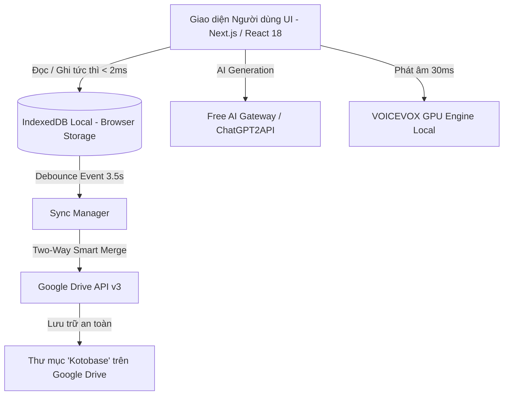

# 🏛️ Kotobase - Kiến Trúc Kỹ Thuật (Architecture Specification)

Tài liệu này mô tả chi tiết kiến trúc tổng thể, mô hình dữ liệu và các luồng xử lý kỹ thuật của dự án **Kotobase** - Nền tảng học từ vựng và Hán tự tiếng Nhật hiện đại.

---

## 1. Triết Lý Thiết Kế: Local-First Architecture

Kotobase được chuyển đổi từ mô hình Server-Heavy (Firestore/Firebase) sang mô hình **Local-First (Ưu tiên cục bộ)** nhằm đạt được 3 mục tiêu cốt lõi:

1. **Tốc độ phản hồi cực nhanh (Zero-latency / < 2ms):** Mọi thao tác thêm từ, lật Flashcard, làm bài Quiz, lọc theo thư mục đều truy xuất trực tiếp từ IndexedDB trong trình duyệt.
2. **Khả năng hoạt động 100% Offline:** Người dùng có thể học tập trên máy bay, tàu điện ngầm hoặc khi mất kết nối Internet mà không bị gián đoạn.
3. **Không giới hạn chi phí & Hạn mức (Zero Database Cost / No Quota Exhaustion):** Loại bỏ hoàn toàn giới hạn 50.000 reads/ngày của Firebase Firestore. Dữ liệu thuộc quyền sở hữu 100% của người dùng.



---

## 2. Công Nghệ Sử Dụng (Tech Stack)

* **Frontend Framework:** [Next.js 14](https://nextjs.org/) (App Router, Server Components & Client Components).
* **Ngôn ngữ:** TypeScript 5.5 (Strict Mode).
* **Styling & Design System:** TailwindCSS, Tailwind Merge, Lucide React Icons, Dark/Light Mode qua `next-themes`.
* **Lưu trữ Cục bộ (Local Storage):** HTML5 IndexedDB (`kotobase_local_db_v1`).
* **Đồng bộ Đám mây (Cloud Sync):** Google Identity Services (GIS) & Google Drive REST API v3.
* **AI Vocabulary Engine:** Free Reverse GPT-4o Gateway & Tích hợp `chatgpt2api` local.
* **Text-to-Speech (TTS):** VOICEVOX Engine (Hỗ trợ GPU CUDA / DirectML), Cloud Voicevox, ElevenLabs & Web Speech API.

---

## 3. Cấu Trúc Dữ Liệu IndexedDB (`src/lib/db.ts`)

Cơ sở dữ liệu IndexedDB `kotobase_local_db_v1` bao gồm 3 Object Stores chính:

### 3.1. Store `folders` (Cây Thư Mục Bài Học)
```typescript
interface LocalFolder {
  id: string;              // UUID duy nhất dạng 'folder_<timestamp>_<random>'
  name: string;            // Tên bài học / thư mục (VD: "Bài 1 Minna", "N3 Từ vựng")
  parentId: string | null; // ID của thư mục cha (null nếu là thư mục gốc Root)
  order?: number;          // Thứ tự sắp xếp hiển thị
  createdAt: string;       // ISO Timestamp (VD: "2026-08-21T00:00:00.000Z")
  updatedAt: string;       // ISO Timestamp dùng cho Two-Way Smart Merge
}
```

### 3.2. Store `vocabularies` (Kho Từ Vựng & SRS Data)
```typescript
interface LocalVocabulary {
  id: string;              // UUID duy nhất dạng 'vocab_<timestamp>_<random>'
  word: string;            // Từ vựng tiếng Nhật (Kanji hoặc Kana)
  meaning: string;         // Nghĩa tiếng Việt
  reading?: string;        // Cách đọc Hiragana
  sinoVietnamese?: string; // Âm Hán Việt viết HOA (VD: "THỰC", "ƯỚC THÚC")
  example?: string;        // Câu ví dụ tiếng Nhật
  exampleMeaning?: string; // Nghĩa tiếng Việt của câu ví dụ
  note?: string;           // Ghi chú ngữ cảnh
  folderIds: string[];     // Mảng các ID thư mục chứa từ vựng
  tags: string[];          // Danh sách tags phân loại
  jlptLevel?: string;      // Cấp độ JLPT (N5, N4, N3, N2, N1)

  // Dữ liệu thuật toán ôn tập ngắt quãng (Anki SM-2 SRS):
  srsInterval?: number;    // Khoảng cách ngày ôn tập tiếp theo
  srsRepetition?: number;  // Số lần nhớ liên tiếp
  srsEaseFactor?: number;  // Hệ số ghi nhớ (Mặc định 2.5)
  srsNextReview?: string;  // Thời điểm ôn tập tiếp theo (ISO string)

  createdAt: string;
  updatedAt: string;
}
```

### 3.3. Store `metadata` (Thông Tin Cấu Hình & Trạng Thái)
Lưu trữ thông tin phiên bản dữ liệu, ID thiết bị và lịch sử đồng bộ.

---

## 4. Cấu Trúc Thư Mục Dự Án

```
kotobase/
├── docs/                        # Tài liệu kỹ thuật chi tiết
│   ├── ARCHITECTURE.md          # Kiến trúc hệ thống
│   ├── GOOGLE_DRIVE_SYNC.md     # Cơ chế đồng bộ Google Drive
│   ├── AI_FEATURES.md           # Tự động hóa từ vựng bằng AI
│   ├── TTS_ENGINE.md            # Hệ thống phát âm VOICEVOX GPU
│   ├── ANKI_SRS.md              # Thuật toán Anki SM-2
│   └── SETUP_GUIDE.md           # Hướng dẫn cài đặt & vận hành
├── src/
│   ├── app/                     # Next.js 14 App Router
│   │   ├── api/                 # Backend API Routes (AI, Auth, Jisho, Kanji)
│   │   ├── kanji/               # Trang tra cứu Hán tự
│   │   ├── layout.tsx           # Root Layout & Theme Providers
│   │   └── page.tsx             # Main Application Entrypoint
│   ├── components/              # React UI Components
│   │   ├── BulkImport.tsx       # Tạo từ vựng tự động bằng AI & Bulk JSON
│   │   ├── Dashboard.tsx        # Trọng tâm Dashboard điều khiển
│   │   ├── FlashcardView.tsx    # Chế độ học Flashcard & Nghe
│   │   ├── FolderTree.tsx       # Quản lý cây thư mục bài học (Kéo thả, CRUD)
│   │   ├── GoogleDriveSyncModal.tsx # Giao diện đồng bộ Drive
│   │   ├── QuizView.tsx         # Trắc nghiệm kiểm tra từ vựng
│   │   └── TypingQuizView.tsx   # Gõ phím luyện phản xạ Hiragana/Romaji
│   ├── lib/                     # Core Business Logic & Libraries
│   │   ├── db.ts                # IndexedDB Local-First Engine
│   │   ├── google-drive.ts      # Google Drive API Client & Kotobase Folder Manager
│   │   ├── sync-manager.ts      # Quản lý đồng bộ ngầm & Smart Merge
│   │   ├── tts-utils.ts         # Quản lý âm thanh VOICEVOX Local GPU / Cloud
│   │   └── anki-utils.ts        # Thuật toán SuperMemo SM-2
├── services/
│   └── chatgpt2api/             # Module AI Backend Proxy cục bộ (Python)
├── scripts/
│   └── start-all.js             # Launcher song song Web + AI Backend
├── start_all.bat                # Khởi động trọn gói 1-Click cho Windows
└── package.json                 # Cấu hình dự án & Scripts
```
