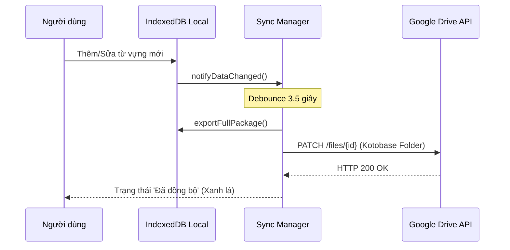

# ☁️ Đồng Bộ Google Drive (Google Drive Sync Specification)

Tài liệu này mô tả chi tiết cơ chế đồng bộ dữ liệu hai chiều (Two-Way Synchronization) giữa trình duyệt của người dùng và dịch vụ **Google Drive API v3**.

---

## 1. Cơ Chế Lưu Trữ Trên Google Drive

Toàn bộ dữ liệu của người dùng được lưu trữ an toàn trong **thư mục riêng biệt `Kotobase`** trên Google Drive cá nhân:

* **Tên thư mục trên Drive:** `Kotobase` (MIME Type: `application/vnd.google-apps.folder`)
* **Tên tệp sao lưu:** `kotobase_backup.json` (MIME Type: `application/json`)
* **Dung lượng tệp:** Thường dao động từ **20KB đến 500KB** (tiết kiệm 99.9% dung lượng Google Drive).

### Cấu Trúc Gói Dữ Liệu `kotobase_backup.json`:
```json
{
  "version": 1,
  "exportedAt": "2026-08-21T00:00:00.000Z",
  "folders": [
    {
      "id": "folder_1724200000000_abc123",
      "name": "Bài 1 Minna no Nihongo",
      "parentId": null,
      "order": 0,
      "createdAt": "2026-08-21T00:00:00.000Z",
      "updatedAt": "2026-08-21T00:00:00.000Z"
    }
  ],
  "vocabularies": [
    {
      "id": "vocab_1724200000000_xyz789",
      "word": "約束",
      "meaning": "lời hứa, cuộc hẹn",
      "reading": "やくそく",
      "sinoVietnamese": "ƯỚC THÚC",
      "example": "友達と映画を見る約束をした。",
      "exampleMeaning": "Tôi đã hẹn xem phim với bạn.",
      "folderIds": ["folder_1724200000000_abc123"],
      "srsInterval": 1,
      "srsEaseFactor": 2.5,
      "createdAt": "2026-08-21T00:00:00.000Z",
      "updatedAt": "2026-08-21T00:00:00.000Z"
    }
  ]
}
```

---

## 2. Xác Thực Google OAuth 2.0 (Google Identity Services)

Hệ thống sử dụng **Google Identity Services (GIS) Token Client** ở phía Frontend, không yêu cầu lưu trữ Client Secret hay token trên server trung gian:

* **Scope yêu cầu:** `https://www.googleapis.com/auth/drive.file` (Chỉ cho phép ứng dụng đọc và ghi các tệp do chính ứng dụng tạo ra, đảm bảo an toàn và bảo mật tuyệt đối cho toàn bộ tệp tin cá nhân khác của người dùng).
* **Token Caching:** Access Token được lưu trữ an toàn trong `localStorage` kèm thời điểm hết hạn `expiresAt`. Khi token hết hạn, hệ thống sẽ tự động yêu cầu cấp mới qua GIS Popup.

---

## 3. Thuật Toán Two-Way Smart Merge (`src/lib/sync-manager.ts`)

Khi người dùng thực hiện **Đồng bộ / Khôi phục**, hệ thống sẽ so khớp dữ liệu cục bộ (IndexedDB) với dữ liệu trên Google Drive theo thuật toán **Last-Write-Wins (LWW) dựa trên `updatedAt`**:

1. **So khớp Folders:**
   * Duyệt qua toàn bộ thư mục từ cả hai nguồn (Local & Remote).
   * Nếu cùng `id`: Giữ lại phiên bản có `updatedAt` mới hơn.
   * Nếu `id` chỉ có ở một bên: Giữ lại thư mục đó (không xóa mất dữ liệu bài học).
2. **So khớp Vocabularies:**
   * Tương tự Folders, từ vựng được so khớp theo `id` và thời điểm `updatedAt`.
   * Bảo toàn toàn bộ tiến độ học Anki SRS (`srsInterval`, `srsNextReview`, `srsEaseFactor`).



---

## 4. Tự Động Đồng Bộ Ngầm (Debounced Auto-Sync)

* Mỗi khi người dùng thêm từ mới, sửa bài học, hoặc làm bài tập xong, hệ thống kích hoạt bộ đếm thời gian **Debounce (3.5 giây)**.
* Nếu trong 3.5 giây người dùng tiếp tục thao tác, bộ đếm được reset lại.
* Khi người dùng dừng thao tác 3.5s, `syncManager.backupNow(true)` sẽ âm thầm upload dữ liệu mới nhất lên Google Drive mà không gây giật lag giao diện.
