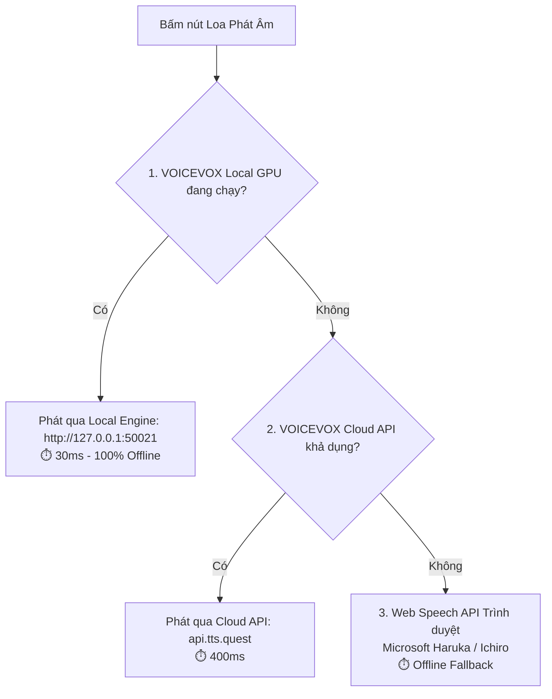

# 🎙️ Động Cơ Phát Âm (Text-to-Speech Engine Specification)

Tài liệu này mô tả chi tiết kiến trúc phát âm giọng đọc tiếng Nhật trong **Kotobase**, bao gồm hỗ trợ **VOICEVOX GPU CUDA**, **Voicevox Cloud**, **ElevenLabs** và **Web Speech API**.

---

## 1. Kiến Trúc Phát Âm 3 Tầng (3-Tier TTS Architecture)

Kotobase sử dụng mô hình ưu tiên 3 tầng để đảm bảo âm thanh luôn phát ra ngay lập tức và phát âm chuẩn nhất:



---

## 2. VOICEVOX Local GPU (Khuyên Dùng Cho Trải Nghiệm Tốt Nhất)

### 2.1. Tại sao VOICEVOX là lựa chọn số 1 cho tiếng Nhật?
* **Phát âm theo trọng âm Tokyo (Tokyo Pitch Accent):** Khác với Google TTS (thường đọc đều giọng và sai ngữ điệu), VOICEVOX tích hợp bộ từ điển Open JTalk nhận diện chính xác âm cao/thấp (Atamadaka, Nakadaka, Odaka, Heiban).
* **Giọng đọc tự nhiên của Seiyuu bản xứ:** Hơn 30+ giọng nhân vật Anime Nhật Bản (Meimei Himari, Zundamon, Tsumugi, Ritsu...).
* **Tận dụng Card đồ họa (NVIDIA GPU / DirectML):** Thời gian sinh âm thanh cực ngắn: **~30 mili-giây**.

### 2.2. Giao thức kết nối Local (`src/lib/tts-utils.ts`)
1. **Bước 1 (Audio Query):**
   ```http
   POST http://127.0.0.1:50021/audio_query?text=約束&speaker=14
   ```
2. **Bước 2 (Synthesis WAV):**
   ```http
   POST http://127.0.0.1:50021/synthesis?speaker=14
   Content-Type: application/json
   Body: <AudioQuery JSON>
   ```
3. **Bước 3 (Playback):**
   * Trình duyệt nhận binary data dạng `audio/wav` blob và phát ngay qua Web Audio API.

---

## 3. Tùy Chọn Nâng Cao: ElevenLabs AI

Người dùng có thể cấu hình API Key và Voice ID của ElevenLabs trong phần **Cài đặt $\rightarrow$ Cài đặt Phát âm**:
* **Model:** `eleven_turbo_v2_5`
* **Ràng buộc ngôn ngữ:** `language_code: "ja"`
* **Tốc độ đọc tối ưu:** `speed: 0.85 - 0.90` (tối ưu cho người học tiếng Nhật).
